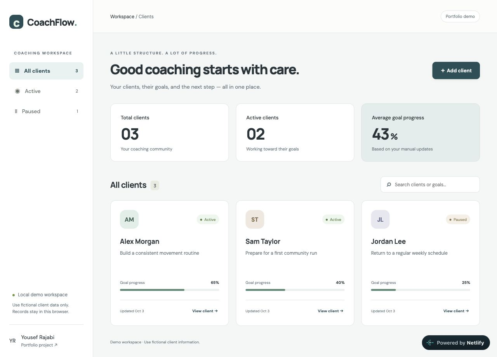
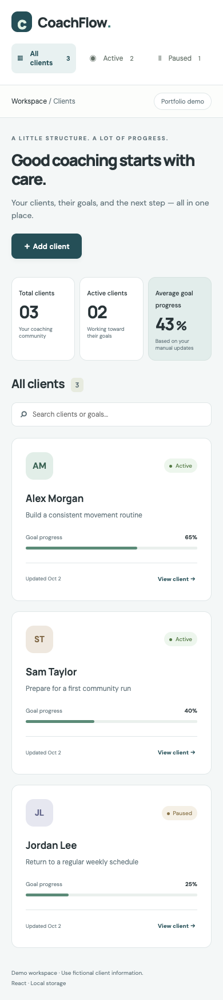

# CoachFlow

A local demo dashboard for organizing fictional coaching clients, goals, and notes.

A working, AI-assisted learning project in Yousef Rajabi's junior developer portfolio. The code is intentionally organized around straightforward React components and browser APIs. It is not a claim of client work or production deployment experience.

## Screenshot

Screenshots show the optional sample data, not real tasks or clients.



<details><summary>Mobile view</summary>



</details>

## Live Demo

[Open CoachFlow](https://yousef-coachflow.netlify.app/)

Data stays in localStorage in this browser; use fictional records for the public demo.

## Features

- Add, edit, search, filter, and delete clients with confirmation.
- View a client detail screen with workout and nutrition notes.
- Record a manually entered progress percentage between 0 and 100.
- Calculate total/active client counts and average recorded progress.
- Persist records locally with validation and storage failure feedback.
- Load three explicitly fictional sample clients on demand.
- Responsive cards, accessible forms, keyboard dialogs, and useful empty states.

## Tech Stack

React 19, JavaScript, CSS, Vite, localStorage, and Playwright browser tests.

## Installation

Requires Node.js 22.12+ (Node.js 24 recommended) and npm.

```bash
git clone https://github.com/yousefrajabi06-debug/coachflow.git
cd coachflow
npm install
npm run dev
```

Open the local URL printed by Vite. No environment variables or private credentials are required.

```bash
npm run build       # build the production assets in dist/
npm run preview     # preview the production build locally
npx playwright install chromium
npm test            # run browser behavior tests
```

`npm ci` uses the committed lockfile for reproducible installs. CI installs Chromium and runs the build and tests. Browser tests cover client management, validation, and responsive behavior.

## Project structure

```text
src/
  App.jsx          # screen state and application behavior
  components/      # focused, reusable UI pieces
  hooks/           # validated localStorage state
  styles.css       # layout, typography, responsive states
tests/             # browser behavior tests
docs/LEARNING.md   # guided exercises and code walkthrough
```

## What I Learned

Component composition, form validation, CRUD operations, selected-record state, computed summaries, and localStorage. See [the learning guide](docs/LEARNING.md) for explanations and rebuild exercises. This describes concepts demonstrated by the implementation, not a claim of independent mastery.

## Limitations

Browser storage is tied to this browser and origin. Clearing site data removes saved records. There is no account login, cross-device sync, or backend. An invalid saved data shape falls back to an empty list. External fonts have a system-font fallback.

## Demo scope

Use fictional records only. This is a browser-local learning app without accounts, access control, a server, or a database. Notes and progress are entered manually; the app does not produce training or nutrition recommendations. Sample records are fictional and use `example.com` email addresses.

## Future improvements

Add dated check-ins and progress history; add export/import; design authentication and a secure backend before considering real client use.

## Author

[Yousef Rajabi](https://github.com/yousefrajabi06-debug) — Full-Stack development student. Built with AI-assisted development as a learning project.
